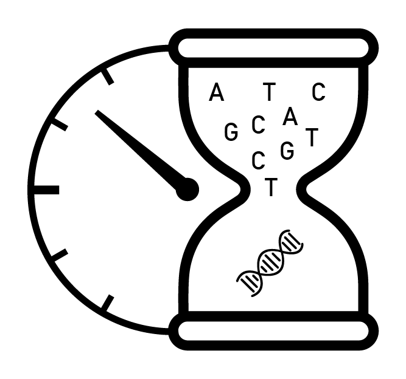
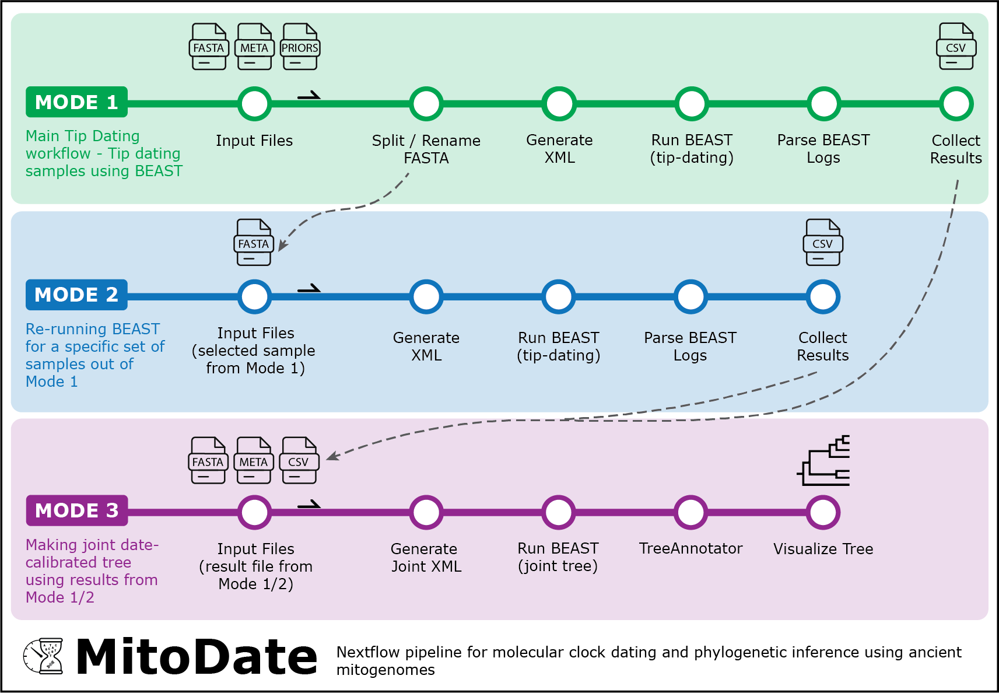

# MitoDate

MitoDate is a Nextflow pipeline for molecular clock dating of ancient mitochondrial genomes with BEAST, following the methodology published in Chacón-Duque et al., MBE (2025).
It can be used in three modes. `tip_dating` runs the main workflow from aligned FASTA, metadata, and priors. `rerun_samples` reruns selected samples from an earlier `tip_dating` run without starting over. `joint_tree` builds the final dated tree after you have reviewed the tip-dating results.

## Quick Navigation

1. [Pipeline Requirements and Configuration](docs/1_requirements_and_configuration.md)
2. [Pipeline Steps](docs/2_pipeline_steps.md)
3. [How to Run MitoDate](docs/3_how_to_run.md)
4. [Data Cleanup](docs/4_data_cleanup.md)
5. [Changelogs](docs/5_changelogs.md)

## Support

Wenxi Li (wenxi.li@sund.ku.dk)
Bilal Sharif (bilal.bioinfo@gmail.com)

## Citation

If you use MitoDate in your research, please cite:

Li, W., Sharif, B., Heintzman, P. D., Dalén, L. and Chacón-Duque, J. C. 2026. MitoDate: a Nextflow pipeline for molecular clock dating and phylogenetic inference using ancient mitogenomes. – bioRxiv. : 2026.07.28.741234.

